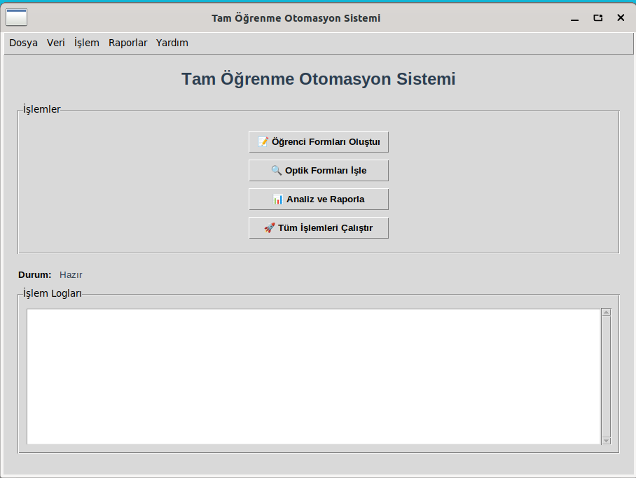
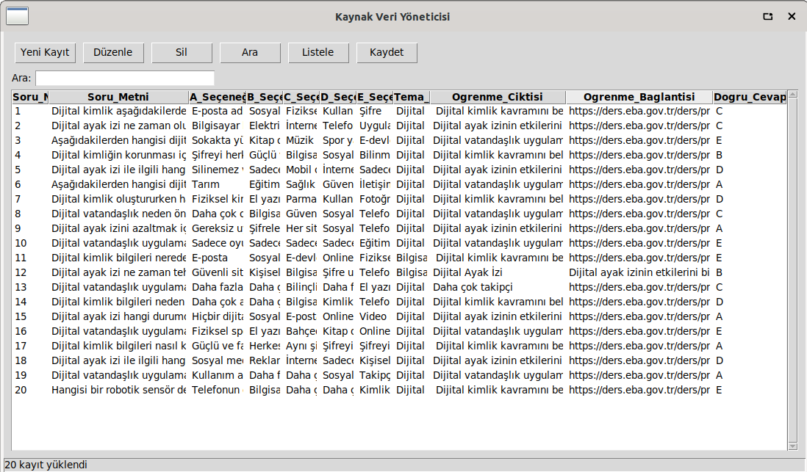
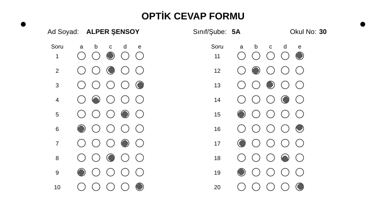
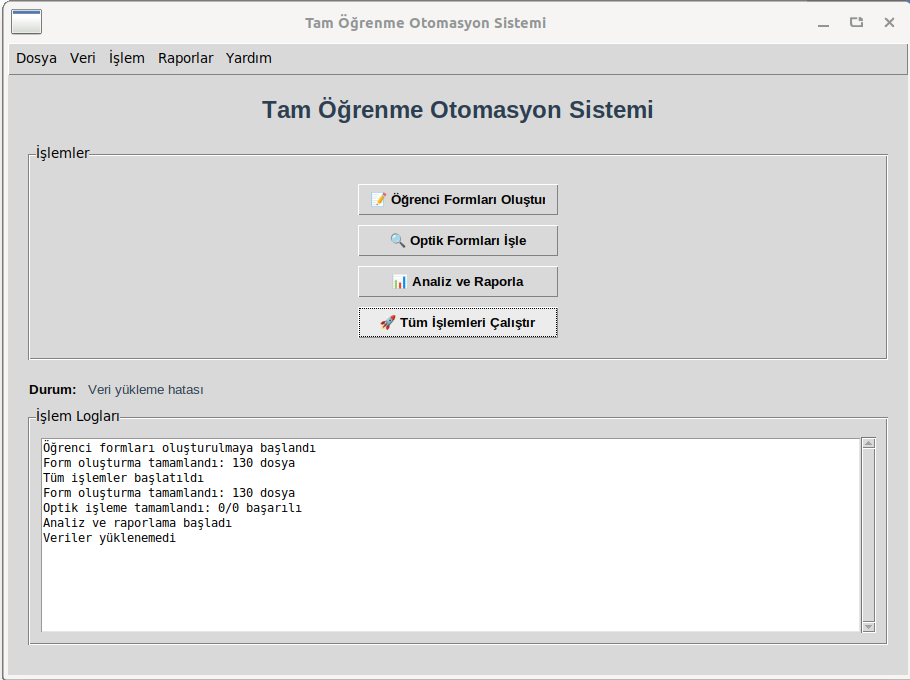

# 🤖 Yapay Zeka Destekli Tam Öğrenme Otomasyon Sistemi

Python tabanlı, öğrenci veri analizi ve otomatik raporlama sistemi. Tkinter GUI arayüzü ile kullanıcı dostu eğitim otomasyon çözümü.


## 🌟 Öne Çıkan Özellikler

- 📊 **Öğrenci Başarı Analizi**: Detaylı öğrenci performans takibi ve görselleştirme
- 📝 **Optik Form İşleme**: Otomatik optik form oluşturma, okuma ve değerlendirme  
- 🤖 **Yapay Zeka Destekli**: Akıllı veri analizi ve tahminleme algoritmaları
- 📈 **Otomatik Raporlama**: HTML ve JSON formatında detaylı rapor oluşturma
- 🖼️ **Modern Arayüz**: Tkinter tabanlı kullanıcı dostu grafik arayüz
- 🖨️ **Yazdırma Desteği**: Optik formları ve raporları yazdırma özelliği

## ⚙️ Kurulum

Projeyi çalıştırmadan önce gerekli bağımlılıkları yükleyin:

```bash
pip install -r requirements.txt
```

---

## ▶️ Çalıştırma

GUI arayüzünü başlatmak için:

```bash
python main.py
```

CLI (komut satırı) modu için:

```bash
python main.py -cli
```

---

## 📑 Lisans
Bu proje eğitim amaçlıdır.  
İstediğiniz gibi geliştirebilir ve özelleştirebilirsiniz.
## 📸 Proje Görselleri

## 📸 Proje Görselleri

### Giriş Ekranı


### Öğrenci Analiz Sayfası


### Öğrenci Form Oluşturma


### Öğrenci Donut Grafiği


### Öğrenci Hissiyat Analizi


### Detaylı Analiz


### Rapor İzleme


### Tüm İşlemleri Çalıştır


