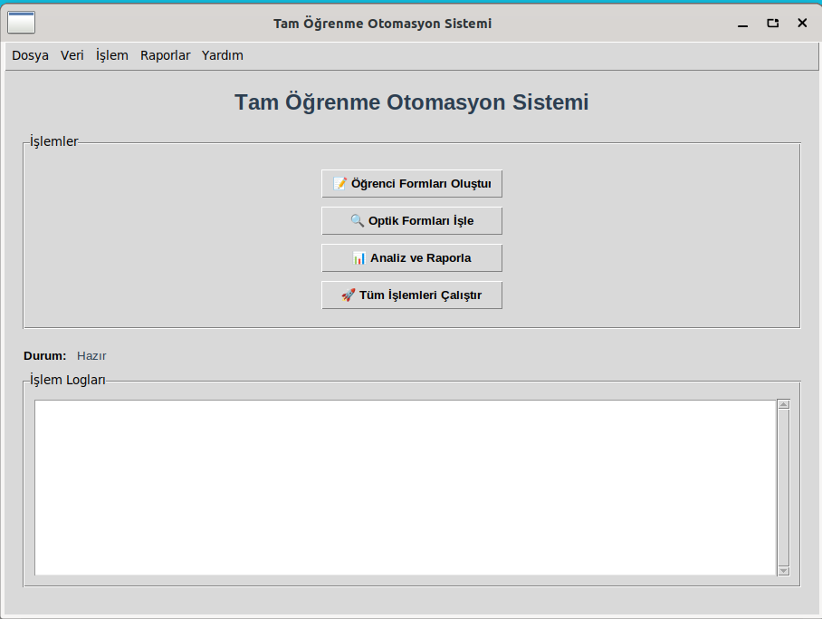
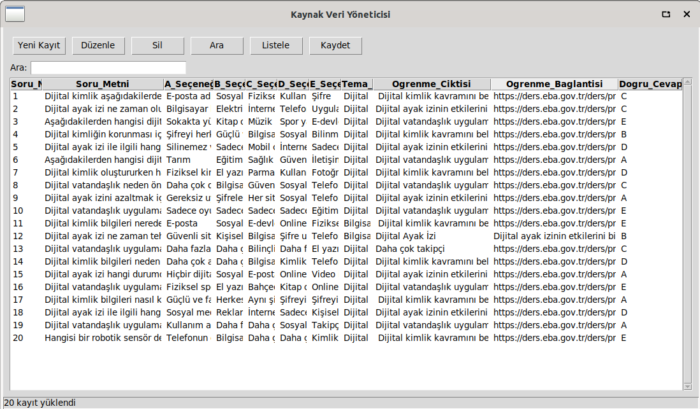
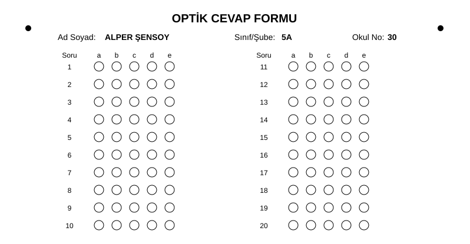
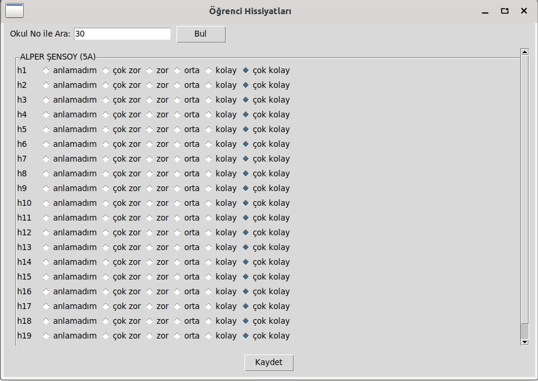
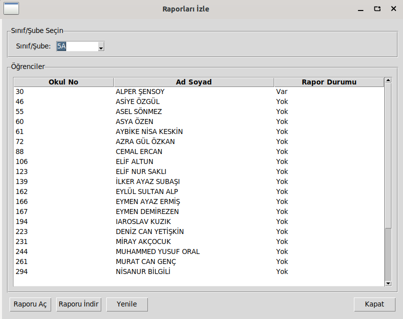

# 📘 Tam Öğrenme Otomasyon Sistemi

Bu proje, öğrenci verilerini işleyen, optik formları okuyan, analiz eden ve rapor üreten **Python tabanlı bir otomasyon sistemidir**.  
Tkinter tabanlı bir GUI (grafik arayüz) ile kullanıcı dostu bir deneyim sunar.

---

## 🚀 Özellikler
- 📂 Öğrenci, kaynak ve hissiyat verilerini CSV üzerinden yönetme  
- 📝 Öğrenciler için optik formlar oluşturma  
- 🔍 Optik formları okuma ve değerlendirme  
- 📊 Başarı analizi ve raporlama (HTML & JSON raporları)  
- 🖼️ Tkinter tabanlı modern grafik arayüz  
- 🖨️ Optik formları yazdırma desteği  

---

## 📂 Dizin Yapısı
```
├── main.py                # Ana uygulama
├── core/                  # Çekirdek işlem modülleri
├── gui/                   # Tkinter GUI ekranları
├── data/                  # Örnek veri dosyaları
├── utils/                 # Yardımcı fonksiyonlar
├── templates/             # HTML şablonları
├── static/                # CSS ve JS dosyaları
├── requirements.txt       # Gerekli Python paketleri
└── docs/README.md         # Proje belgeleri
```

---

## ⚙️ Kurulum

Projeyi çalıştırmadan önce gerekli bağımlılıkları yükleyin:

```bash
pip install -r requirements.txt
```

---

## ▶️ Çalıştırma

GUI arayüzünü başlatmak için:

```bash
python main.py
```

CLI (komut satırı) modu için:

```bash
python main.py -cli
```

---

## 📑 Lisans
Bu proje eğitim amaçlıdır.  
İstediğiniz gibi geliştirebilir ve özelleştirebilirsiniz.
## 📸 Proje Görselleri

## 📸 Proje Görselleri

### Giriş Ekranı


### Öğrenci Analiz Sayfası


### Öğrenci Form Oluşturma


### Öğrenci Donut Grafiği


### Öğrenci Hissiyat Analizi


### Detaylı Analiz


### Rapor İzleme


### Tüm İşlemleri Çalıştır

